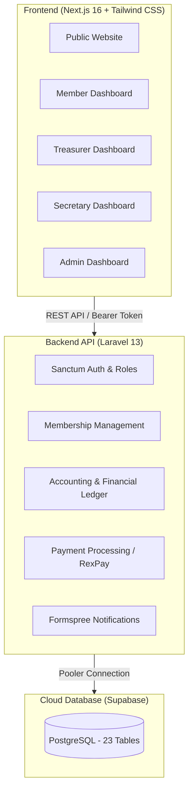

# THE PECKERS FORTE — Association Management Platform

> **"Two Wings • One Vision"**
> 
> - **Premier Multipurpose Cooperative Society** — *Contribution Wing (People • Community • Impact)*
> - **Premier Alliance Portfolio** — *Investment Wing (Capital • Growth • Prosperity)*

---

## 🌟 Overview

THE PECKERS FORTE is a comprehensive, enterprise-grade association and cooperative management platform built with a high-performance Next.js 16 frontend and a robust Laravel 13 REST API backend backed by Supabase PostgreSQL.

---

## 🏗️ Architecture



---

## 🚀 Quick Start (Local Development)

### Prerequisites
- PHP 8.3+ with `pdo_pgsql`, `openssl`, `mbstring`, `curl`
- Node.js 18+ and npm
- Composer

### 1. Backend Setup
```bash
cd backend
cp .env.example .env
# Fill in your Supabase DB credentials and APP_KEY
php artisan key:generate
php artisan migrate --force
php artisan db:seed --force
php artisan serve --port=8000
```

### 2. Frontend Setup
```bash
cd frontend
npm install
npm run dev -- --port 3001
```

Access the app at `http://localhost:3001`.

---

## ☁️ Deploying to Vercel

1. Log into your [Vercel Dashboard](https://vercel.com/dashboard).
2. Click **Add New...** > **Project**.
3. Import `damidacurator/the-peckers-forte`.
4. In the Project Settings:
   - **Root Directory**: `frontend` (or leave as root with the included `vercel.json`)
   - **Framework Preset**: `Next.js`
5. Configure Environment Variables in Vercel:
   | Variable | Value |
   |---|---|
   | `NEXT_PUBLIC_API_URL` | Your deployed backend API URL (or local URL) |
   | `NEXT_PUBLIC_FORMSPREE_ENDPOINT` | `https://formspree.io/f/moeqgrqd` |
   | `NEXT_PUBLIC_SUPABASE_URL` | `https://yifatzhpmnsjbvkytkrs.supabase.co` |
   | `NEXT_PUBLIC_SUPABASE_ANON_KEY` | `sb_publishable_cJfyCOo7FS-YPYJzWjYmMA_Mt-Fibrs` |
6. Click **Deploy**.

---

## 🔐 Default Admin Account

- **Email**: `admin@thepeckersforte.com`
- **Role**: `Super Admin`
- **Membership ID**: `TPF-2026-0001`

---

## 🛡️ License
Private & Proprietary — THE PECKERS FORTE.
